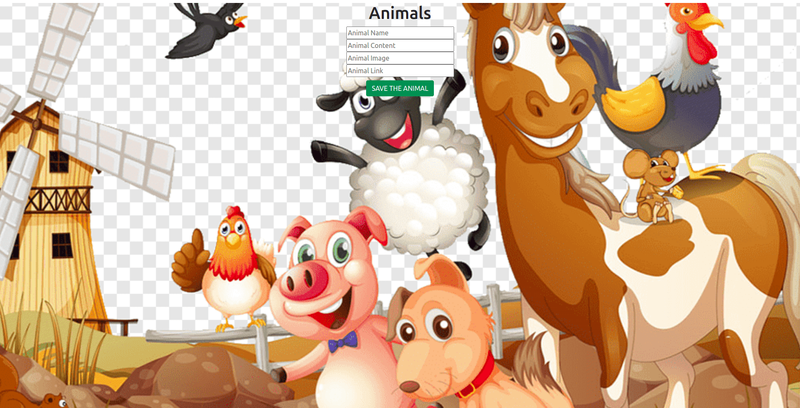
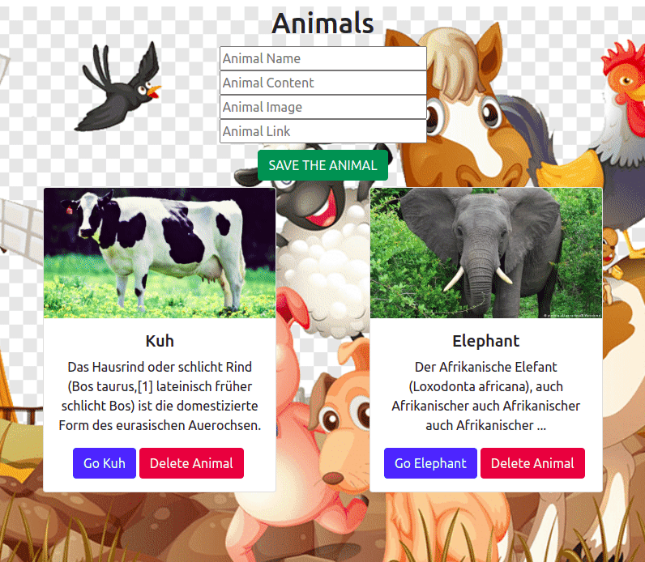

## ANIMAL CARDS - REACT PROJECT -USAGE OF USEREDUCER

## Table of Contents

- [General info](#general-info)
- [Preview](#preview)
- [Technologies](#technologies)
- [Contact](#contact)

## General Info

This project is made with React. 
The project is an example of using the useReducer from React Hooks.
In addition, with the help of a single button, taking all the data from the inputs and sending them to the useReducer state is another important aspect of this small application.

## Preview

### Adding Animal

### Deleting Animal

## Technologies

- JavaScript
- React
- Npm
- Bootstrap
- GitHub

## Contact

Created by Ahmet Yanik - feel free to contact me for any inquiries!
ahmetyank4242@gmail.com
